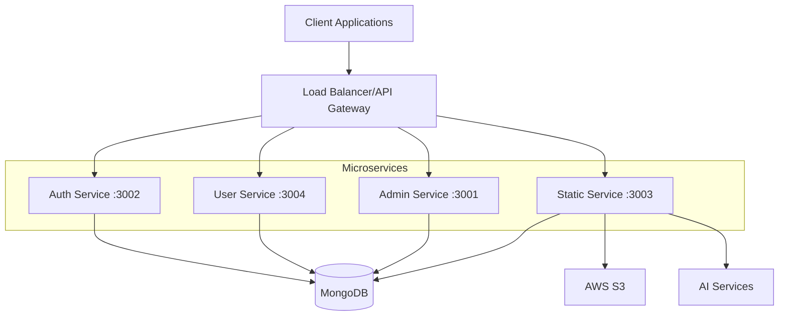

# 🚀 Microservice Architecture with Nx & NestJS

<div align="center">
  
  
</div>

<div align="center">
  <h3>A scalable microservice architecture built with Nx monorepo and NestJS framework</h3>
  <p>
    <a href="#getting-started">Getting Started</a> •
    <a href="#architecture">Architecture</a> •
    <a href="#services">Services</a> •
    <a href="#deployment">Deployment</a>
  </p>
</div>

---

## 📋 Table of Contents

- [Overview](#overview)
- [Architecture](#architecture)
- [Prerequisites](#prerequisites)
- [Getting Started](#getting-started)
- [Services](#services)
- [Development Commands](#development-commands)
- [Docker Deployment](#docker-deployment)
- [Environment Configuration](#environment-configuration)
- [API Documentation](#api-documentation)
- [Contributing](#contributing)

## 🎯 Overview

This project implements a microservice architecture using **Nx monorepo** for workspace management and **NestJS** for building scalable Node.js server-side applications. The architecture consists of four main services that handle different aspects of the application:

- **Authentication Service** - User authentication and authorization
- **User Service** - User management and profile operations
- **Admin Service** - Administrative operations and management
- **Static Service** - File processing, AI integrations, and utility services

## 🏗️ Architecture



### Service Communication
- **Port Allocation**: Each service runs on a dedicated port
- **Database**: Shared MongoDB instance across all services
- **External Integrations**: AWS S3, AI services (Google Generative AI)

## 📋 Prerequisites

Before running this project, ensure you have the following installed:

- **Node.js** (v16 or higher)
- **npm** or **yarn**
- **MongoDB** (local or cloud instance)
- **Docker** (for containerized deployment)
- **Git**

## 🚀 Getting Started

### 1. Clone the Repository

```bash
git clone <repository-url>
cd Microservice-Architecture
```

### 2. Install Dependencies

```bash
npm install
```

### 3. Environment Setup

Create a `.env` file in the root directory with the following variables:

```env
# Database
MONGODB_URI=mongodb://localhost:27017/microservice-db

# JWT Configuration
JWT_SECRET=your-jwt-secret-key
JWT_EXPIRES_IN=24h

# Email Configuration
EMAIL_HOST=smtp.gmail.com
EMAIL_PORT=587
EMAIL_USER=your-email@gmail.com
EMAIL_PASS=your-email-password

# AWS S3 Configuration
AWS_ACCESS_KEY_ID=your-aws-access-key
AWS_SECRET_ACCESS_KEY=your-aws-secret-key
AWS_REGION=us-east-1
AWS_S3_BUCKET=your-s3-bucket

# Google AI
GOOGLE_AI_API_KEY=your-google-ai-api-key

# Application URLs
CLIENT_URL=http://localhost:3000
```

### 4. Start Development Servers

#### Start All Services
```bash
npm run start:all
```

#### Start Individual Services
```bash
# Authentication Service (Port 3002)
npm run start:auth

# User Service (Port 3004)
npm run start:user

# Admin Service (Port 3001)
npm run start:admin

# Static Service (Port 3003)
npm run start:static
```

## 🏢 Services

### 🔐 Authentication Service (`apps/auth`)
**Port: 3002** | **Base URL: `http://localhost:3002/api`**

Handles all authentication and authorization operations.

#### Features:
- User registration and login
- JWT token management
- Email verification
- Password reset functionality
- Forgot password workflow

#### Key Components:
- `AuthController` - Authentication endpoints
- `RegisterService` - User registration logic
- `EmailService` - Email notifications
- `ForgotPasswordService` - Password recovery
- `VerifyEmailService` - Email verification
- `ResetPasswordService` - Password reset

#### Models:
- `User` - User authentication data
- `UserProfile` - Extended user information

---

### 👤 User Service (`apps/user`)
**Port: 3004** | **Base URL: `http://localhost:3004/api`**

Manages user profiles, applications, and user-related operations.

#### Features:
- Personal profile management
- Application submissions
- Profile completion tracking
- File upload and management
- Resume text processing
- Subscription management
- AI-powered application assistance

#### Key Components:
- `UserController` - User management endpoints
- `PersonalProfileService` - Profile operations
- `ApplicationService` - Application management
- `UserApplicationService` - Application processing
- `UserApplicationAiService` - AI assistance
- `ProfileCompletionService` - Progress tracking
- `SubscriptionService` - Subscription management
- `EmailService` - User notifications

---

### 👑 Admin Service (`apps/admin`)
**Port: 3001** | **Base URL: `http://localhost:3001/api`**

Administrative interface for system management and oversight.

#### Features:
- Administrative dashboard
- User management
- System monitoring
- Content management

#### Key Components:
- `AdminController` - Administrative endpoints
- `AdminService` - Administrative operations

---

### 🔧 Static Service (`apps/static`)
**Port: 3003** | **Base URL: `http://localhost:3003/api`**

Handles file processing, AI integrations, and utility services.

#### Features:
- PDF processing and text extraction
- Resume parsing and analysis
- AI-powered content generation
- Mock interview generation
- University and program data management
- AWS S3 file storage
- Contact form handling
- Recommendation engine
- Scenario generation

#### Key Components:
- `StaticController` - Static content endpoints
- `PdfExtractService` - PDF text extraction
- `ResumeParseService` - Resume analysis
- `AiExtractService` - AI content processing
- `AiExtractLlamaService` - Llama AI integration
- `MockInterviewService` - Interview generation
- `S3Service` - AWS S3 operations
- `UniversityService` - University data
- `ProgramService` - Program management
- `ContactService` - Contact handling
- `RecommendationService` - Recommendations
- `ScenarioService` - Scenario generation
- `ProfileQuestionsService` - Profile questions

#### AI Integrations:
- Google Generative AI
- Custom AI models for content processing
- Resume parsing algorithms

## 🛠️ Development Commands

### Nx Commands

#### Build Commands
```bash
# Build all applications
npx nx run-many --target=build --all

# Build specific application
npx nx build auth
npx nx build user
npx nx build admin
npx nx build static
```

#### Development Commands
```bash
# Serve all applications in development mode
npx nx run-many --target=serve --all

# Serve specific application
npx nx serve auth     # Port 3002
npx nx serve user     # Port 3004
npx nx serve admin    # Port 3001
npx nx serve static   # Port 3003
```

#### Testing Commands
```bash
# Run all tests
npx nx run-many --target=test --all

# Run tests for specific application
npx nx test auth
npx nx test user
npx nx test admin
npx nx test static
```

#### Linting Commands
```bash
# Lint all applications
npx nx run-many --target=lint --all

# Lint specific application
npx nx lint auth
npx nx lint user
npx nx lint admin
npx nx lint static
```

#### Utility Commands
```bash
# Show dependency graph
npx nx graph

# Show project information
npx nx show project auth
npx nx show project user
npx nx show project admin
npx nx show project static

# Generate new application
npx nx g @nx/node:app new-app

# Generate new library
npx nx g @nx/node:lib new-lib
```

## 🐳 Docker Deployment

### Using Docker Compose

The project includes a `docker-compose.yml` file for easy containerized deployment.

#### Start All Services
```bash
docker-compose up -d
```

#### Stop All Services
```bash
docker-compose down
```

#### View Logs
```bash
# All services
docker-compose logs -f

# Specific service
docker-compose logs -f auth
docker-compose logs -f user
docker-compose logs -f admin
docker-compose logs -f static
```

#### Rebuild and Start
```bash
docker-compose up --build -d
```

### Individual Docker Commands

#### Build Images
```bash
# Build all images
docker build -t microservice-auth ./apps/auth
docker build -t microservice-user ./apps/user
docker build -t microservice-admin ./apps/admin
docker build -t microservice-static ./apps/static
```

#### Run Individual Containers
```bash
# Run Auth Service
docker run -d -p 3002:3002 --name auth-service microservice-auth

# Run User Service
docker run -d -p 3004:3004 --name user-service microservice-user

# Run Admin Service
docker run -d -p 3001:3001 --name admin-service microservice-admin

# Run Static Service
docker run -d -p 3003:3003 --name static-service microservice-static
```

## 🔧 Environment Configuration

### Required Environment Variables

Create a `.env` file in the root directory:

```env
# Database Configuration
MONGODB_URI=mongodb://localhost:27017/microservice-db
DB_NAME=microservice-db

# JWT Configuration
JWT_SECRET=your-super-secret-jwt-key-here
JWT_EXPIRES_IN=24h
REFRESH_TOKEN_SECRET=your-refresh-token-secret
REFRESH_TOKEN_EXPIRES_IN=7d

# Email Configuration (SMTP)
EMAIL_HOST=smtp.gmail.com
EMAIL_PORT=587
EMAIL_SECURE=false
EMAIL_USER=your-email@gmail.com
EMAIL_PASS=your-email-app-password

# AWS S3 Configuration
AWS_ACCESS_KEY_ID=your-aws-access-key-id
AWS_SECRET_ACCESS_KEY=your-aws-secret-access-key
AWS_REGION=us-east-1
AWS_S3_BUCKET=your-s3-bucket-name

# Google AI Configuration
GOOGLE_AI_API_KEY=your-google-ai-api-key

# Application Configuration
NODE_ENV=development
CLIENT_URL=http://localhost:3000
API_BASE_URL=http://localhost

# Service URLs (for inter-service communication)
AUTH_SERVICE_URL=http://localhost:3002
USER_SERVICE_URL=http://localhost:3004
ADMIN_SERVICE_URL=http://localhost:3001
STATIC_SERVICE_URL=http://localhost:3003

# File Upload Configuration
MAX_FILE_SIZE=10485760  # 10MB
ALLOWED_FILE_TYPES=pdf,doc,docx,txt,jpg,jpeg,png

# Rate Limiting
RATE_LIMIT_TTL=60
RATE_LIMIT_REQUESTS=100
```

### Production Environment

For production deployment, ensure you:

1. **Update CORS origins** in each service's `main.ts`
2. **Use production MongoDB URI**
3. **Set NODE_ENV=production**
4. **Use HTTPS URLs**
5. **Configure proper logging**
6. **Set up monitoring and health checks**

## 📚 API Documentation

### Service Endpoints

#### Authentication Service (Port 3002)
```
POST   /api/auth/register         - User registration
POST   /api/auth/login            - User login
POST   /api/auth/refresh          - Refresh JWT token
POST   /api/auth/forgot-password  - Initiate password reset
POST   /api/auth/reset-password   - Reset password
POST   /api/auth/verify-email     - Verify email address
GET    /api/auth/profile          - Get user profile
```

#### User Service (Port 3004)
```
GET    /api/users/profile              - Get user profile
PUT    /api/users/profile              - Update user profile
POST   /api/users/applications         - Create application
GET    /api/users/applications         - Get user applications
PUT    /api/users/applications/:id     - Update application
DELETE /api/users/applications/:id     - Delete application
POST   /api/users/upload               - Upload files
GET    /api/users/subscription         - Get subscription status
POST   /api/users/subscription         - Manage subscription
```

#### Admin Service (Port 3001)
```
GET    /api/admin/dashboard        - Admin dashboard data
GET    /api/admin/users            - Get all users
PUT    /api/admin/users/:id        - Update user
DELETE /api/admin/users/:id        - Delete user
GET    /api/admin/applications     - Get all applications
GET    /api/admin/analytics        - System analytics
```

#### Static Service (Port 3003)
```
POST   /api/static/pdf-extract     - Extract text from PDF
POST   /api/static/resume-parse    - Parse resume content
POST   /api/static/ai-extract      - AI content processing
POST   /api/static/mock-interview  - Generate mock interview
GET    /api/static/universities    - Get universities data
GET    /api/static/programs        - Get programs data
POST   /api/static/contact         - Contact form submission
GET    /api/static/recommendations - Get recommendations
POST   /api/static/scenarios       - Generate scenarios
```

### API Response Format

All APIs follow a consistent response format:

```json
{
  "success": true,
  "message": "Operation successful",
  "data": {
    // Response data
  },
  "error": null,
  "timestamp": "2024-01-01T00:00:00.000Z"
}
```

Error responses:
```json
{
  "success": false,
  "message": "Error description",
  "data": null,
  "error": {
    "code": "ERROR_CODE",
    "details": "Detailed error information"
  },
  "timestamp": "2024-01-01T00:00:00.000Z"
}
```

## 🔍 Monitoring & Health Checks

### Health Check Endpoints

Each service provides health check endpoints:

```bash
# Check service health
curl http://localhost:3001/api/health  # Admin
curl http://localhost:3002/api/health  # Auth
curl http://localhost:3003/api/health  # Static
curl http://localhost:3004/api/health  # User
```

### Logging

Services use NestJS built-in logger. Logs include:
- Request/Response logging
- Error tracking
- Performance metrics
- Database operations

## 🧪 Testing

### Unit Tests
```bash
# Run all unit tests
npm run test

# Run tests for specific service
npx nx test auth
npx nx test user
npx nx test admin
npx nx test static
```

### Integration Tests
```bash
# Run integration tests
npm run test:e2e
```

### Test Coverage
```bash
# Generate coverage report
npm run test:coverage
```

## 🚀 Deployment Guide

### Development Deployment
1. Clone repository
2. Install dependencies: `npm install`
3. Configure environment variables
4. Start services: `npm run start:all`

### Production Deployment

#### Option 1: Docker Compose
```bash
# Production build
docker-compose -f docker-compose.prod.yml up -d
```

#### Option 2: PM2 Process Manager
```bash
# Install PM2
npm install -g pm2

# Build all services
npx nx run-many --target=build --all

# Start with PM2
pm2 start ecosystem.config.js
```

#### Option 3: Kubernetes
```bash
# Apply Kubernetes manifests
kubectl apply -f k8s/
```

## 🔒 Security Considerations

- **Authentication**: JWT-based authentication with refresh tokens
- **Authorization**: Role-based access control (RBAC)
- **CORS**: Configured for specific origins
- **Rate Limiting**: Implemented on all public endpoints
- **Input Validation**: DTO validation using class-validator
- **File Upload**: Restricted file types and sizes
- **Environment Variables**: Sensitive data stored in environment variables

## 🤝 Contributing

1. **Fork the repository**
2. **Create a feature branch**: `git checkout -b feature/new-feature`
3. **Make changes and test**: `npm run test`
4. **Commit changes**: `git commit -m "Add new feature"`
5. **Push to branch**: `git push origin feature/new-feature`
6. **Create Pull Request**

### Development Guidelines

- Follow NestJS best practices
- Write unit tests for new features
- Update documentation
- Use TypeScript strictly
- Follow existing code style
- Add proper error handling

## 📝 Changelog

### Version 1.0.0
- Initial microservice architecture setup
- Authentication service implementation
- User management service
- Admin panel service
- Static content and AI processing service
- Docker containerization
- Nx monorepo configuration

## 📄 License

This project is licensed under the MIT License - see the [LICENSE](LICENSE) file for details.

## 🙏 Acknowledgments

- [Nx](https://nx.dev) - Monorepo management
- [NestJS](https://nestjs.com) - Node.js framework
- [MongoDB](https://mongodb.com) - Database
- [AWS S3](https://aws.amazon.com/s3/) - File storage
- [Google AI](https://ai.google.dev) - AI services

---

<div align="center">
  <p>Made with ❤️ by the development team</p>
  <p>For support, please contact: <a href="mailto:support@yourcompany.com">support@yourcompany.com</a></p>
</div>
```

```sh
npx nx g @nx/node:lib mylib
```

You can use `npx nx list` to get a list of installed plugins. Then, run `npx nx list <plugin-name>` to learn about more specific capabilities of a particular plugin. Alternatively, [install Nx Console](https://nx.dev/getting-started/editor-setup?utm_source=nx_project&utm_medium=readme&utm_campaign=nx_projects) to browse plugins and generators in your IDE.

[Learn more about Nx plugins &raquo;](https://nx.dev/concepts/nx-plugins?utm_source=nx_project&utm_medium=readme&utm_campaign=nx_projects) | [Browse the plugin registry &raquo;](https://nx.dev/plugin-registry?utm_source=nx_project&utm_medium=readme&utm_campaign=nx_projects)


[Learn more about Nx on CI](https://nx.dev/ci/intro/ci-with-nx#ready-get-started-with-your-provider?utm_source=nx_project&utm_medium=readme&utm_campaign=nx_projects)

## Install Nx Console

Nx Console is an editor extension that enriches your developer experience. It lets you run tasks, generate code, and improves code autocompletion in your IDE. It is available for VSCode and IntelliJ.

[Install Nx Console &raquo;](https://nx.dev/getting-started/editor-setup?utm_source=nx_project&utm_medium=readme&utm_campaign=nx_projects)

## Useful links

Learn more:

- [Learn more about this workspace setup](https://nx.dev/nx-api/node?utm_source=nx_project&amp;utm_medium=readme&amp;utm_campaign=nx_projects)
- [Learn about Nx on CI](https://nx.dev/ci/intro/ci-with-nx?utm_source=nx_project&utm_medium=readme&utm_campaign=nx_projects)
- [Releasing Packages with Nx release](https://nx.dev/features/manage-releases?utm_source=nx_project&utm_medium=readme&utm_campaign=nx_projects)
- [What are Nx plugins?](https://nx.dev/concepts/nx-plugins?utm_source=nx_project&utm_medium=readme&utm_campaign=nx_projects)

And join the Nx community:
- [Discord](https://go.nx.dev/community)
- [Follow us on X](https://twitter.com/nxdevtools) or [LinkedIn](https://www.linkedin.com/company/nrwl)
- [Our Youtube channel](https://www.youtube.com/@nxdevtools)
- [Our blog](https://nx.dev/blog?utm_source=nx_project&utm_medium=readme&utm_campaign=nx_projects)

<!-- to enable auto reload -->
npx nx reset
npx nx daemon
npx nx serve service-name


# Auth service (example: port 3002)
docker run -d --name auth-service -p 3002:3002 auth-service

# Static service (example: port 3003)
docker run -d --name static-service -p 3003:3003 static-service

# User service (example: port 3004)
docker run -d --name user-service -p 3004:3004 user-service

# Admin service (example: port 3005)
docker run -d --name admin-service -p 3005:3005 admin-service